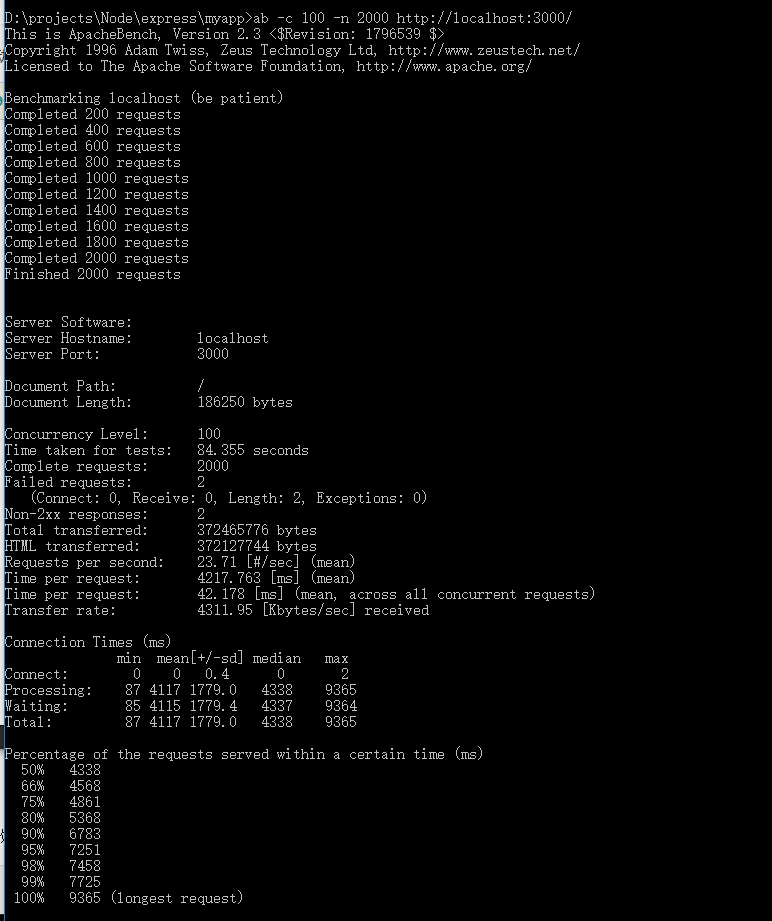
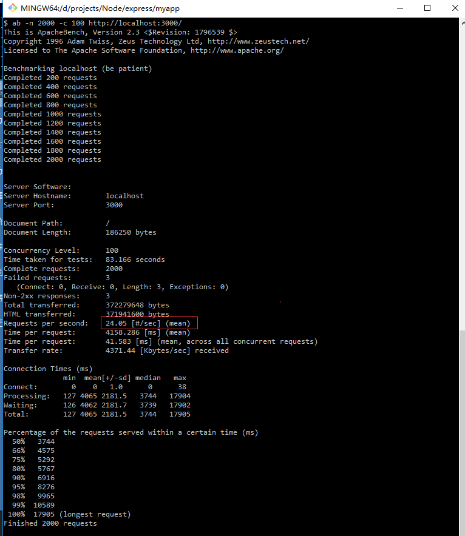
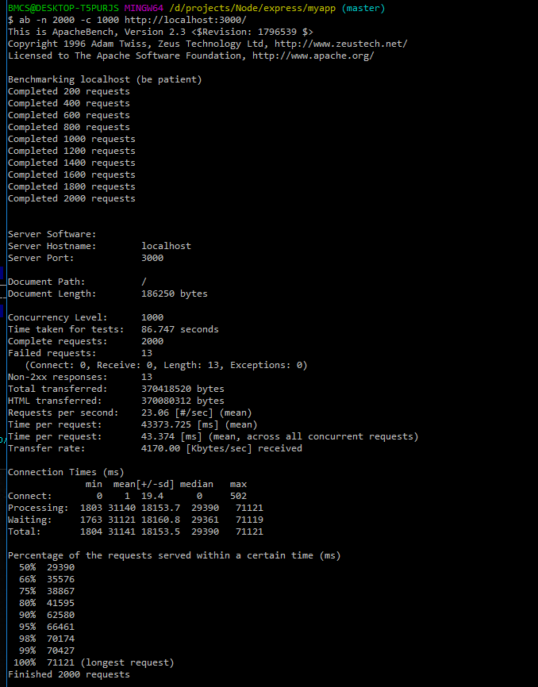
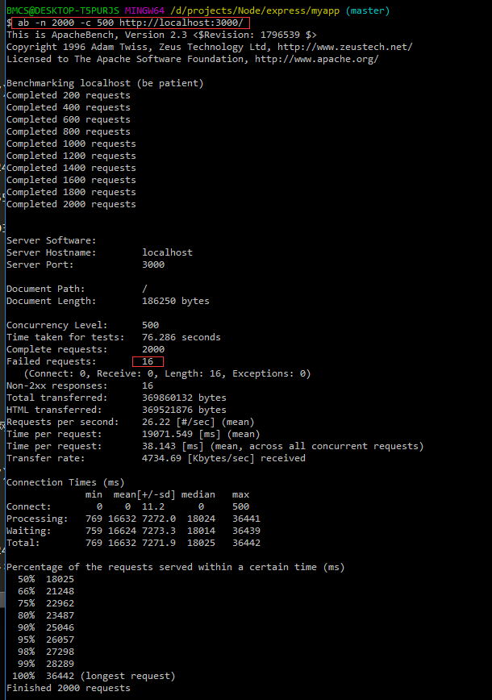
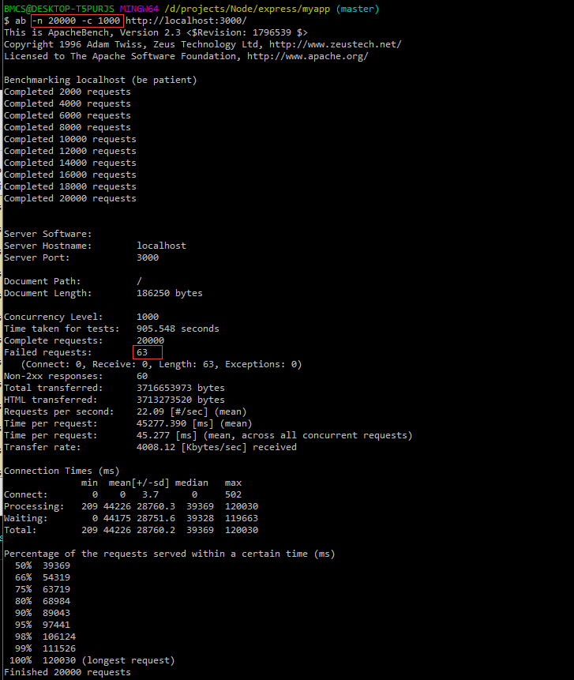

1. 使用pm2启动3个实例，执行压力测试
``` cs
ab -c 100 -n 2000 http://localhost:3000/
```


2. 使用pm2启动5个实例，执行压力测试
``` cs
ab -c 100 -n 2000 http://localhost:3000/
```
失败数 3


测试1000并发
``` cs
ab -c 1000 -n 2000 http://localhost:3000/
```
失败数 13


测试500并发
``` cs
ab -c 500 -n 2000 http://localhost:3000/
```
失败数 16


测试1000并发，总数20000
``` cs
ab -c 500 -n 2000 http://localhost:3000/
```
失败数 63
